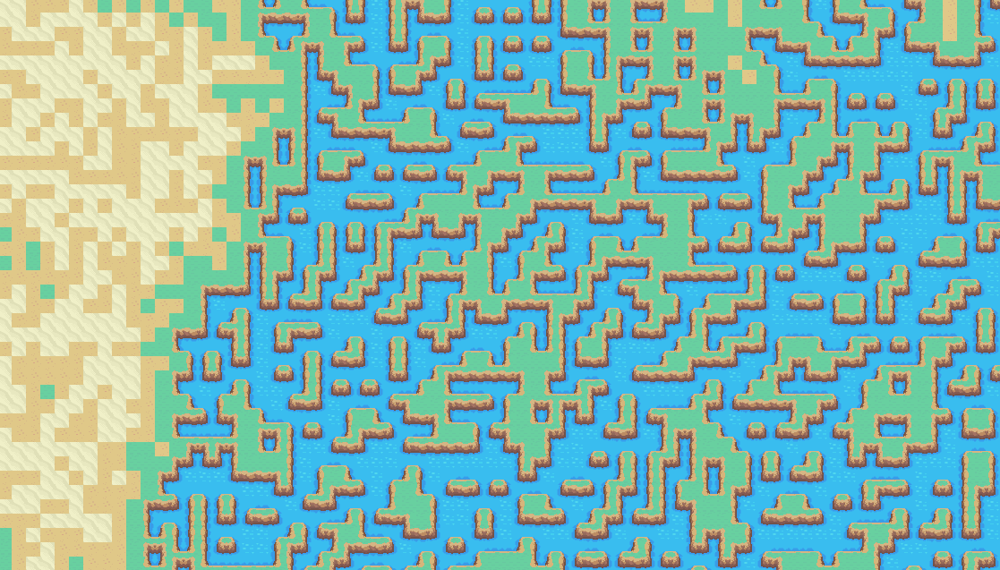
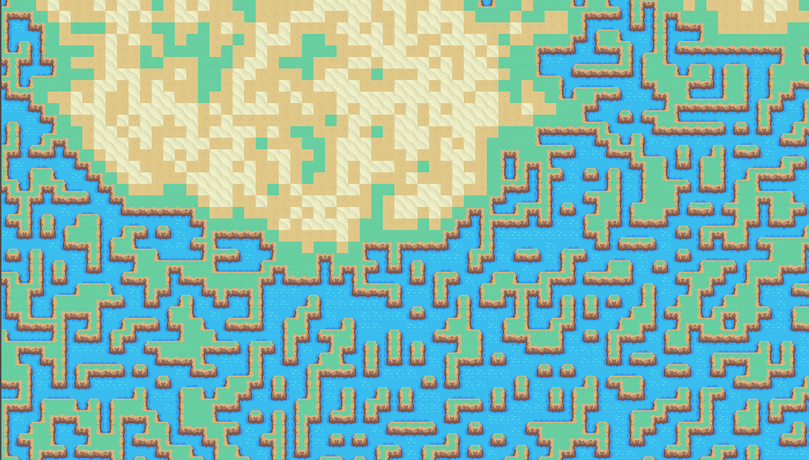

# Wave Function Collapse Algorithm in Godot

This project is an implementation of the Wave Function Collapse (WFC) algorithm, designed for generating procedural 2d maps.
The project was developed in Godot with all core logic written in C#. The visual output is rendered in Godot using its tilemap system, and the algorithm's rules are customizable via a JSON file.

## Screenshots:

### [Inspiration link](https://github.com/mxgmn/WaveFunctionCollapse)

## Overview
Inspired by procedural generation for a roguelike game, this project explores the Wave Function Collapse algorithm:
- **Algorithm Logic**: All logic is written in C#, handling tile selection and rule application.
- **Rule Customization**: A JSON file defines generation rules, allowing easy customization for different patterns and constraints.
- **Display**: Godot's integrated tilemap system in C# is used to display the generated maps.

## Features
- **Procedural Map Generation**: Generates unique maps based on predefined rules.
- **Customizable Rules**: Adjust rules in a JSON file to control tile behaviors and constraints.
- **Godot Integration**: Uses Godot only for rendering, keeping logic separated for modularity.

## Getting Started

1. Clone the repository
2. Import the project in Godot 
